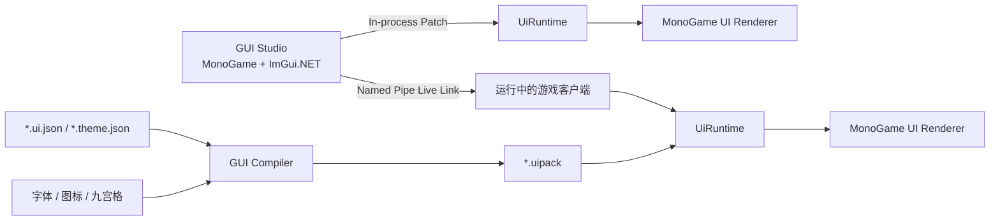

# MonoGame 客户端 GUI Studio 产品需求与技术设计文档（PRD）

| 项目 | 内容 |
| --- | --- |
| 文档状态 | Draft / 可用于立项与任务拆分 |
| 文档版本 | 0.1 |
| 编写日期 | 2026-07-29 |
| 目标项目 | Crystal / Legend of Mir 客户端 |
| 目标运行时 | .NET 8、MonoGame 3.8.5、WindowsDX |
| 主要读者 | 客户端开发、工具开发、UI 美术、策划、测试 |

## 1. 摘要

本项目拟建设一套面向游戏客户端的可视化 GUI 调试与制作工具，暂定名为 **GUI Studio**。

GUI Studio 允许开发者、美术或策划在不重新编译、不重启客户端的情况下，实时创建和修改游戏界面的尺寸、布局、样式、数据绑定与交互行为。编辑器预览窗口与正式客户端共用同一套 MonoGame GUI Runtime，确保编辑器显示结果与游戏实际显示结果一致。

开发阶段使用可读、可版本管理的 JSON 文件保存布局和主题；正式发布时通过 GUI Compiler 验证并编译为只读的 `.uipack`，以降低加载时间、减少文件数量，并兼容 Native AOT。

首期以任务日志、聊天窗口、血蓝状态、技能快捷栏、人物属性面板等典型界面为验证对象，最终形成可供整个客户端复用的 UI 制作与运行体系。

## 2. 背景与问题

当前通过 C# 代码直接调用 `SpriteBatch` 绘制界面可以实现任意视觉效果，但存在以下问题：

1. 调整位置、尺寸和颜色需要修改代码、编译并重新启动。
2. 布局、渲染、输入和业务逻辑容易耦合在同一个类中。
3. 不同界面各自实现面板、按钮、边框和状态，难以保持统一风格。
4. 多分辨率适配依赖人工计算，容易产生错位、拉伸和鼠标命中错误。
5. UI 美术和策划无法独立验证效果，修改必须经过程序开发。
6. 热重载若直接替换整个界面，会丢失滚动位置、输入内容、选中项和动画状态。
7. 中文字体、图标、九宫格皮肤和资源生命周期缺少统一管理方式。
8. Native AOT 不适合依赖运行时反射、动态类型发现或任意脚本解释。

因此，需要把 GUI 从“代码写死的绘制逻辑”升级为“数据驱动的 UI 文档 + 统一主题 + 实时预览编辑器 + 可复用运行时”。

## 3. 产品目标

### 3.1 必须实现

- 可视化创建、删除、复制和排列 UI 控件。
- 实时修改尺寸、位置、锚点、间距、颜色、透明度和样式。
- 修改结果在编辑器画布和运行中的游戏客户端内实时刷新。
- 编辑器和正式客户端使用同一个 GUI Runtime 和 MonoGame 渲染实现。
- 支持任务窗口、聊天窗口、状态 HUD、快捷栏、人物属性等客户端 GUI。
- 支持统一 Theme，并允许整个客户端一键切换或调整视觉风格。
- 支持 16:9、16:10、窗口化和不同 DPI 下的布局预览。
- 支持中文字体、字体回退、图标图集和九宫格纹理。
- 支持鼠标、键盘、焦点、滚动、拖动、悬停和提示框。
- 开发阶段使用 JSON，正式版本编译为 `.uipack`。
- 设计时配置错误不得导致客户端崩溃或清空现有界面。
- 运行时设计兼容 .NET 8 和 Native AOT。

### 3.2 成功指标

| 指标 | 目标 |
| --- | --- |
| 属性修改到预览更新 | 本地 Live Link P95 小于 50 ms |
| 文件保存到客户端更新 | P95 小于 150 ms |
| 普通界面布局耗时 | 500 个可见控件小于 2 ms |
| 普通界面绘制耗时 | 1080p、500 个可见控件小于 3 ms |
| 运行帧率 | 常规 UI 场景稳定 60 FPS |
| 热重载可靠性 | 连续 1,000 次刷新无崩溃、无明显 GPU 资源泄漏 |
| 分辨率覆盖 | 1280×720 至 3840×2160 |
| 编辑器/客户端一致性 | 黄金截图差异在约定阈值内 |
| 错误恢复 | 无效修改不替换当前有效界面 |

### 3.3 非目标

首期不建设通用网页浏览器、完整矢量绘图软件或类似 Figma 的多人云协作平台。

首期不允许在 UI 文件中执行任意 C#、Lua 或 JavaScript。UI 文件只能声明布局、样式、数据绑定和白名单命令，避免安全问题和业务逻辑失控。

首期不替代装备、地图、角色动画等游戏内容资源制作工具。

首期不要求跨平台编辑器；GUI Runtime 应避免无必要的 Windows 专属依赖，但 GUI Studio 可以先仅支持 Windows。

## 4. 目标用户与核心场景

### 4.1 客户端开发

- 创建新的窗口和控件类型。
- 把游戏数据绑定到 UI。
- 注册按钮可调用的游戏命令。
- 调试分辨率适配、焦点、输入和性能。
- 在客户端运行过程中连接 GUI Studio 并检查控件树。

### 4.2 UI 美术

- 调整面板、边框、颜色、阴影、九宫格和图标。
- 修改统一 Theme 并实时观察多个界面。
- 切换不同分辨率和 UI 缩放比例。
- 导出可交付给客户端的 UI 文档与资源包。

### 4.3 策划与测试

- 调整任务列表数量、文本长度和奖励数据。
- 模拟空状态、超长文字、不可用按钮和异常数值。
- 检查不同语言、分辨率和交互状态。
- 通过稳定 ID 定位控件并反馈问题。

## 5. 产品功能需求

### 5.1 工作区

- 创建、打开和保存 GUI 工作区。
- 工作区包含 UI 文档、Theme、字体、图标、纹理和预览数据。
- 展示文件修改状态和验证错误。
- 支持最近打开记录和自动恢复。
- 支持相对路径，工作区移动后仍可打开。

### 5.2 控件树

- 展示当前 UI 文档的父子结构。
- 支持拖动调整层级和顺序。
- 支持搜索、过滤、锁定、隐藏和重命名。
- 每个控件必须具有文档内唯一且稳定的 `id`。
- 删除或修改被数据绑定、动画或事件引用的控件时给出提示。

### 5.3 可视化画布

- 使用真实 MonoGame GUI Runtime 绘制。
- 支持缩放、平移、标尺、参考线、网格和吸附。
- 支持单选、多选、框选、移动和调整大小。
- 显示边距、Padding、锚点、父容器和裁剪区域。
- 可切换 1280×720、1600×900、1920×1080、2560×1440 和自定义尺寸。
- 可模拟 UI Scale、DPI、安全区域和超宽屏。
- 支持显示控件命中区域、布局耗时和绘制批次。

### 5.4 属性检查器

- 编辑通用属性：位置、尺寸、最小/最大值、Margin、Padding、透明度、可见性、启用状态。
- 编辑布局属性：Anchor、Dock、Grid、Stack、Flex、对齐、间距和宽高策略。
- 编辑视觉属性：Theme Style、颜色、九宫格、图标、字体、描边、阴影和过渡动画。
- 编辑交互属性：可点击、可聚焦、Tab 顺序、提示框、拖放和命令。
- 编辑数据属性：文本、列表数据源、格式化、条件可见性和状态映射。
- 属性修改支持撤销和重做。

### 5.5 控件库

MVP 内置以下控件：

- `Canvas`
- `Panel`
- `Border`
- `Image`
- `Label`
- `Button`
- `Toggle`
- `TextBox`
- `ProgressBar`
- `ScrollView`
- `ListView`
- `Grid`
- `StackPanel`
- `Tooltip`
- `Modal`
- `NineSlice`
- `Icon`

第二阶段增加：

- 虚拟化长列表
- 下拉框
- 标签页
- 树形列表
- 拖放槽位
- 物品格
- 技能格
- 圆形血蓝球
- 富文本聊天
- 小地图覆盖层

业务专用控件优先通过组合基础控件实现，只有出现明确性能或交互需求时才新增专用类型。

### 5.6 Theme 与风格系统

- Theme 定义颜色、字体、间距、圆角、边框、阴影、动画时间和资源引用。
- UI 文档默认只引用 Style 名称，不重复保存完整视觉参数。
- 支持 Style 继承，但限制继承层级，避免难以追踪。
- 支持控件状态：`normal`、`hover`、`pressed`、`selected`、`disabled`、`focused`。
- 支持 Theme Token，例如 `Color.Gold.Primary`、`Spacing.M`、`Font.Body`。
- 支持暗黑传奇、简洁现代等多套 Theme，但 MVP 只交付一套正式 Theme。
- Theme 修改通过 Live Link 同步到全部打开界面。

### 5.7 数据绑定

- UI 文档只声明绑定路径，不持有游戏业务对象。
- 运行时接收只读的 UI 数据快照。
- 支持文本、数字、布尔值、集合、枚举和资源键。
- 支持有限且可预测的格式化，例如数字、百分比、时间和本地化键。
- 支持简单条件表达式，但禁止任意代码执行。
- 列表项必须具有稳定的数据键，用于热重载后恢复选中状态。

示例：

```json
{
  "id": "QuestProgress",
  "type": "Label",
  "text": "{SelectedQuest.Current}/{SelectedQuest.Target}",
  "style": "Quest.Objective.Progress",
  "visible": "{SelectedQuest.HasObjective}"
}
```

### 5.8 命令与事件

- UI 文件通过字符串命令 ID 描述行为。
- 游戏客户端通过命令接收接口处理实际业务。
- UI Runtime 不直接调用角色、背包、任务或网络模块。
- 命令参数必须可序列化、可验证。
- 未注册命令只记录错误，不导致崩溃。

示例：

```json
{
  "id": "AbandonQuestButton",
  "type": "Button",
  "text": "放弃任务",
  "command": "Quest.Abandon",
  "commandParameter": "{SelectedQuest.Id}"
}
```

### 5.9 撤销、重做与历史

- 所有编辑操作转换为可逆 Patch。
- 默认保存最近 200 次操作。
- 连续拖动合并为一次逻辑操作。
- 支持撤销结构修改、属性修改、批量对齐和 Theme 修改。
- MVP 不实现跨会话完整历史，但崩溃恢复文件应保留最近有效状态。

### 5.10 验证与错误展示

- 保存前执行 Schema、引用、类型和循环依赖验证。
- 错误定位到文件、控件 ID 和属性。
- 编辑器画布对错误控件显示明显标记。
- Warning 不阻止预览；Error 阻止覆盖客户端中的最后有效版本。
- CLI 编译器在存在 Error 时返回非零退出码。

## 6. 总体技术路线

### 6.1 架构原则

1. **同一运行时**：编辑器预览和游戏客户端必须共用 UiRuntime 与 MonoGame 渲染实现。
2. **数据驱动**：布局和 Theme 不写死在业务代码中。
3. **主线程提交**：解析可后台执行，控件树切换和 GPU 资源操作必须在游戏主线程执行。
4. **原子更新**：新文档完整验证成功后再替换旧文档。
5. **稳定身份**：控件 ID 和列表数据键用于状态迁移。
6. **开发与发布分离**：开发加载 JSON，发布加载 `.uipack`。
7. **AOT 友好**：使用 `System.Text.Json` 源生成，不依赖运行时扫描和动态代码生成。
8. **小 Interface、深 Module**：布局、热重载、状态迁移、资源生命周期和渲染批处理隐藏在 UiRuntime 内部。

### 6.2 逻辑架构



### 6.3 推荐解决方案结构

```text
Client.Gui/
├─ Client.Gui.Model/
│  ├─ UI 文档模型
│  ├─ Theme 模型
│  ├─ Patch 模型
│  └─ JSON Source Generation
├─ Client.Gui.Runtime/
│  ├─ 控件树
│  ├─ 布局
│  ├─ 状态
│  ├─ 数据绑定
│  ├─ 命令路由
│  └─ 热重载与状态迁移
├─ Client.Gui.MonoGame/
│  ├─ SpriteBatch 渲染
│  ├─ 裁剪
│  ├─ 九宫格
│  ├─ 字体
│  ├─ 输入
│  └─ GPU 资源生命周期
├─ Client.Gui.Protocol/
│  ├─ Live Link 消息
│  ├─ Named Pipe Adapter
│  └─ In-process Adapter
├─ Tools.GuiStudio/
│  ├─ 控件树
│  ├─ 画布
│  ├─ 属性检查器
│  ├─ Theme 编辑器
│  └─ 预览数据
├─ Tools.GuiCompiler/
│  ├─ 验证
│  ├─ 字体与图集生成
│  └─ UI Pack 输出
└─ Client.Gui.Tests/
   ├─ 布局测试
   ├─ Patch 测试
   ├─ 状态迁移测试
   └─ 黄金截图测试
```

## 7. 核心 Module 与 Interface

### 7.1 UiRuntime Module

UiRuntime 是整个系统的核心深 Module。调用方不应了解内部控件实现、布局算法或 Patch 应用细节。

建议外部 Interface：

```csharp
public interface IUiRuntime : IDisposable
{
    UiLoadResult Load(UiPackage package);
    UiPatchResult Apply(UiPatchBatch patch);
    void Update(UiFrameInput input, IUiDataSource data, IUiCommandSink commands);
    void Draw(UiDrawContext context);
}
```

Interface 约束：

- `Load` 和 `Apply` 只能在 Update 帧的安全点提交。
- 解析和验证可以提前在后台完成。
- `Apply` 失败时保留最后有效控件树。
- `Update` 不允许阻塞网络或磁盘 IO。
- `Draw` 只能在 MonoGame 图形线程调用。

### 7.2 真实 seam 与 Adapter

#### 资源解析 seam

`IUiAssetResolver` 至少有两个 Adapter：

- 编辑器文件夹 Adapter：支持源文件和热重载。
- 发布 UI Pack Adapter：只读、高效、基于哈希。

#### Live Link seam

`IUiPatchTransport` 至少有两个 Adapter：

- In-process Adapter：GUI Studio 自身预览。
- Named Pipe Adapter：连接运行中的游戏客户端。

#### 绘制记录 seam

生产使用 MonoGame Adapter；测试使用 Recording Adapter 记录绘制命令，用于验证布局和批次，不要求启动图形设备。

### 7.3 不应建立的 seam

MVP 不为每种控件建立独立插件接口。控件库在需求稳定前作为 UiRuntime 的内部实现，避免形成大量浅 Module。

只有当第三方项目确实需要注册自定义控件时，再设计受控的扩展机制。

## 8. UI 文档格式

### 8.1 文件分类

| 文件 | 用途 |
| --- | --- |
| `*.ui.json` | 控件树、布局、绑定和命令 |
| `*.theme.json` | Token、Style 和状态样式 |
| `*.preview.json` | 编辑器预览数据，不进入正式包 |
| `*.uipack` | 正式版本编译产物 |
| `gui-project.json` | 工作区配置、Schema 版本和资源入口 |

### 8.2 示例 UI

```json
{
  "$schema": "crystal-gui://schema/ui/v1",
  "schemaVersion": 1,
  "id": "QuestJournal",
  "root": {
    "id": "Root",
    "type": "Grid",
    "style": "Window.Root",
    "anchor": "Stretch",
    "columns": ["240px", "440px", "1fr"],
    "children": [
      {
        "id": "CategoryList",
        "type": "ListView",
        "column": 0,
        "items": "{Quest.Categories}",
        "itemKey": "{Id}",
        "selectedKey": "{Quest.SelectedCategoryId}",
        "style": "Quest.CategoryList"
      },
      {
        "id": "QuestList",
        "type": "ListView",
        "column": 1,
        "items": "{Quest.VisibleQuests}",
        "itemKey": "{Id}",
        "style": "Quest.List"
      },
      {
        "id": "Details",
        "type": "Panel",
        "column": 2,
        "style": "Quest.Details",
        "children": []
      }
    ]
  }
}
```

### 8.3 示例 Theme

```json
{
  "$schema": "crystal-gui://schema/theme/v1",
  "schemaVersion": 1,
  "tokens": {
    "Color.Background.Panel": "#EB080808",
    "Color.Border.Normal": "#705A37",
    "Color.Border.Selected": "#E79B2A",
    "Color.Text.Primary": "#E8DDD0",
    "Color.Text.Gold": "#D7A936",
    "Spacing.S": 6,
    "Spacing.M": 12,
    "Radius.Window": 8
  },
  "styles": {
    "Quest.Card": {
      "background": "{Color.Background.Panel}",
      "borderColor": "{Color.Border.Normal}",
      "borderWidth": 1,
      "cornerRadius": "{Radius.Window}",
      "padding": "{Spacing.M}"
    },
    "Quest.Card:selected": {
      "borderColor": "{Color.Border.Selected}",
      "borderWidth": 2
    }
  }
}
```

### 8.4 Schema 与迁移

- 所有文档必须包含 `schemaVersion`。
- 新版本读取旧文档时通过显式迁移链升级。
- 不允许在反序列化过程中静默忽略关键未知字段。
- GUI Compiler 输出迁移后的标准格式。
- Schema 变更需要兼容性测试和迁移样例。

## 9. 布局系统

### 9.1 坐标与缩放

- 默认设计画布为 1920×1080。
- 运行时使用逻辑像素，不直接依赖物理像素。
- 根节点计算 UI Scale，并提供 `Fit`、`Fill`、`PixelPerfect` 和用户缩放策略。
- 鼠标坐标必须通过相同矩阵反变换到逻辑坐标。
- 文本和 1 像素线支持像素对齐，减少模糊。

### 9.2 布局能力

- Anchor：固定到父容器的边或中心。
- Dock：占据上、下、左、右或剩余空间。
- Stack：横向或纵向顺序排列。
- Grid：像素、百分比、内容尺寸和剩余空间。
- Flex：用于工具栏、按钮组和响应式区域。
- Canvas：只用于必须绝对定位的 HUD 或装饰。
- Min/Max：限制控件尺寸。
- AspectRatio：约束小地图、头像和图标。
- SafeArea：处理窗口边缘和超宽屏。

### 9.3 布局原则

- 普通窗口优先使用 Grid、Stack 和 Anchor。
- 不允许整个界面完全依赖绝对坐标。
- 装饰层与交互层分离，装饰不得拦截输入。
- 长列表必须使用虚拟化，避免生成不可见项。

## 10. MonoGame 渲染实现

### 10.1 绘制流程

1. UiRuntime 计算可见控件和最终布局。
2. 生成有顺序的绘制命令。
3. MonoGame Adapter 根据纹理、Sampler、Blend 和裁剪状态合批。
4. 使用 `SpriteBatch` 绘制面板、九宫格、图标、字体和进度条。
5. 只在阴影、模糊或特殊遮罩时使用 RenderTarget。

### 10.2 裁剪

- 使用 `RasterizerState.ScissorTestEnable`。
- UiRuntime 维护裁剪栈。
- 子控件裁剪区域与父裁剪区域求交集。
- 同一裁剪区域内尽可能合批，避免频繁 Begin/End。

### 10.3 九宫格

- 窗口边框和带纹理按钮使用 Nine-Slice。
- 中心区域可拉伸或平铺。
- 边角保持原始尺寸。
- GUI Studio 可视化显示切片线。

### 10.4 字体与中文

开发阶段：

- 使用具有合法授权的 TTF/OTF。
- GUI Studio 支持动态生成和预览字形。
- 提供字体回退链，例如 UI 中文字体、符号字体和缺字占位字体。

发布阶段：

- GUI Compiler 扫描本地化文本和指定字符区间。
- 生成一个或多个字体图集及字形度量。
- 大型中文字符集按页拆分，并按使用频率排序。
- 字体图集写入 `.uipack`，不以松散字体文件发布。
- 动态新增文本无法保证在图集中时，应配置合理的回退策略。

### 10.5 GPU 资源生命周期

- 纹理创建、替换和释放在图形主线程执行。
- 热重载的新纹理完成上传后再替换旧引用。
- 旧纹理延迟至安全帧释放。
- UI 文档卸载时释放专属资源引用。
- 建立资源引用计数和调试统计，禁止无限缓存。

## 11. 实时刷新与 Live Link

### 11.1 两级刷新

#### 文件热重载

- 使用 `FileSystemWatcher` 监听 UI、Theme 和资源。
- 50 ms 去抖，合并编辑器一次保存产生的多次事件。
- 文件读取失败时进行有限次数重试。
- 适合作为任何开发环境都能使用的保底方案。

#### Live Link

- GUI Studio 与游戏客户端通过本地命名管道通信。
- 编辑器拖动、输入和修改属性时发送增量 Patch。
- 游戏客户端不需要等待文件保存。
- 默认只在 Debug 或显式开发参数下启用。

### 11.2 Patch 格式

```json
{
  "protocolVersion": 1,
  "sessionId": "studio-01",
  "documentId": "QuestJournal",
  "baseRevision": 126,
  "targetRevision": 127,
  "transactionId": "drag-4492",
  "operations": [
    {
      "op": "set",
      "controlId": "Details",
      "property": "width",
      "value": 760
    }
  ]
}
```

### 11.3 Patch 规则

- 每个文档具有递增 Revision。
- Patch 必须声明 `baseRevision`，避免乱序覆盖。
- 拖动过程中的多个 Patch 共用一个 `transactionId`，撤销时视为一次操作。
- 结构修改和 Theme 修改可以包含多个原子操作。
- Patch 验证失败时返回具体错误，不改变当前控件树。
- Revision 不一致时请求完整文档快照。

### 11.4 状态迁移

热重载时按控件 ID 和数据键迁移：

- 可见性与展开状态
- 滚动位置
- 当前焦点
- 文本输入和光标
- 选中项
- 拖动状态
- 动画时间
- 临时提示框

控件类型发生不兼容变化时，不迁移该控件状态，并记录调试信息。

### 11.5 线程模型

```text
文件线程 / Named Pipe 线程
        │
        ├─ 解析
        ├─ Schema 验证
        └─ 生成不可变 Patch / 文档快照
                 │
                 ▼
MonoGame Update 帧安全点
        ├─ 应用 Patch
        ├─ 迁移状态
        └─ 排队 GPU 资源操作
                 │
                 ▼
MonoGame Draw
        └─ 绘制当前有效快照
```

后台线程不得直接调用 `GraphicsDevice`、`SpriteBatch` 或修改正在绘制的控件树。

## 12. GUI Studio 实现方案

### 12.1 推荐技术

- .NET 8
- MonoGame WindowsDX
- ImGui.NET 作为编辑器 Dock、控件树和属性检查器外壳
- 自研 UiRuntime 负责中央画布中的真实游戏 UI
- `System.Text.Json` 源生成负责文件和协议
- 本地命名管道负责连接游戏客户端

ImGui.NET 只用于开发工具外壳，不进入正式游戏 UI，也不参与最终界面风格。

### 12.2 编辑器窗口

```text
┌──────────────────────────────────────────────────────────────┐
│ 菜单 / 工具栏 / 分辨率 / Live Link 状态                     │
├──────────────┬───────────────────────────────┬───────────────┤
│ 控件库       │                               │ 属性检查器    │
│ 控件树       │       MonoGame 实际画布       │ 布局 / Style │
│ 文件与 Theme │                               │ 绑定 / 事件  │
├──────────────┴───────────────────────────────┴───────────────┤
│ 错误、性能、绘制批次、Patch 日志                            │
└──────────────────────────────────────────────────────────────┘
```

### 12.3 编辑器内部输入

- 编辑器外壳优先处理 Dock、菜单和属性面板输入。
- 画布区域内输入先用于选择框和拖动手柄。
- 预览模式下，输入直接传给 UiRuntime，以测试真实交互。
- 设计模式和预览模式必须有明显状态标识。

## 13. 发布编译

GUI Compiler 执行：

1. 读取项目配置。
2. 升级 Schema。
3. 验证 UI、Theme、绑定、命令和资源引用。
4. 解析 Theme Token 和 Style 继承。
5. 扫描本地化字符并生成字体图集。
6. 生成图标和小纹理图集。
7. 预处理 Nine-Slice 元数据。
8. 输出确定性的 `.uipack`。
9. 输出内容哈希、资源清单和调试映射。

同一输入必须产生相同哈希的输出，便于增量更新和问题定位。

正式客户端默认不加载任意磁盘 JSON，不启用 Named Pipe，不接受远程 Patch。

## 14. Native AOT 约束

- 所有 JSON 类型通过 Source Generation 注册。
- 不使用 `Assembly.GetTypes()` 自动发现控件。
- 不使用 `Activator.CreateInstance(string)` 创建控件。
- 控件类型通过编译期静态表映射。
- 数据绑定路径编译为预定义访问器或显式数据字典，不使用动态表达式编译。
- 不允许 UI 文档加载任意程序集或脚本。
- 发布前增加 Trim/AOT 分析构建，警告视为待处理问题。
- GUI Studio 本身不强制 AOT；正式游戏 Runtime 必须通过 AOT 兼容性检查。

## 15. 开发顺序

以下周期是假设一名熟悉 .NET/MonoGame 的开发者全职投入，用于相对排期，不作为承诺。

### 阶段 0：技术验证（3～5 个工作日）

交付：

- 从 JSON 加载一个任务日志界面。
- MonoGame 绘制 Panel、Label、Button、Grid 和 ListView。
- 修改 JSON 后自动刷新。
- 无效 JSON 保留旧界面。
- 记录 1080p 布局和绘制时间。

验收：

- 无需重新编译即可修改尺寸、颜色和文本。
- 文件保存后 150 ms 内刷新。
- 连续刷新 200 次无崩溃。

### 阶段 1：UiRuntime 核心（1～2 周）

交付：

- UI 文档模型与 Schema。
- 控件树、稳定 ID 和生命周期。
- Canvas、Anchor、Grid、Stack 基础布局。
- Theme Token 与控件状态。
- Recording 绘制 Adapter 和单元测试。

验收：

- 布局测试不依赖图形设备。
- 关键布局在五种分辨率下结果稳定。
- Theme 修改可影响多个控件。

### 阶段 2：MonoGame 渲染与输入（1～2 周）

交付：

- SpriteBatch 绘制 Adapter。
- 裁剪栈、九宫格、字体和图标。
- 鼠标命中、焦点、滚动和按钮状态。
- GPU 资源缓存和释放。

验收：

- 能还原任务日志、聊天窗口和底部 HUD。
- 500 个可见控件满足性能指标。
- 1,000 次资源替换无持续内存增长。

### 阶段 3：热重载与 Live Link（1 周）

交付：

- 文件热重载。
- Named Pipe 协议。
- Revision、Transaction 和 Patch。
- 状态迁移。
- 错误返回和完整快照回退。

验收：

- 拖动属性 P95 50 ms 内更新。
- 重载后保持滚动、选中和输入状态。
- Patch 乱序或错误时客户端不崩溃。

### 阶段 4：GUI Studio MVP（2 周）

交付：

- 控件库、控件树、画布和属性检查器。
- 选择、移动、缩放、层级调整。
- 撤销和重做。
- 分辨率与 DPI 模拟。
- Live Link 状态和错误面板。

验收：

- 不编写 C# 即可完成任务日志布局。
- 保存后可进入版本管理。
- GUI Studio 与游戏客户端截图一致。

### 阶段 5：数据绑定与客户端接入（1～2 周）

交付：

- 数据快照、列表绑定和格式化。
- 命令路由。
- 任务、角色、聊天预览数据。
- 第一个真实游戏界面接入。

验收：

- 任务日志使用真实客户端数据。
- UI 文件不引用游戏业务类型。
- 未注册绑定和命令有明确错误。

### 阶段 6：中文、资源与发布工具（1～2 周）

交付：

- 中文字体图集。
- 字体回退。
- 图标图集和 Nine-Slice 编辑。
- GUI Compiler 与 `.uipack`。
- AOT/Trim 检查。

验收：

- 简体中文界面无缺字。
- 发布目录不需要松散 UI 字体和布局 JSON。
- 相同输入生成相同 UI Pack 哈希。

### 阶段 7：扩展控件与迁移（持续）

按收益依次迁移：

1. 任务日志
2. 人物属性
3. 背包与装备格
4. 聊天窗口
5. 底部 HUD 和技能栏
6. 商店、仓库和交易
7. 登录、角色选择和设置

每迁移一个界面，先补足可复用基础能力，再移除旧实现，避免新旧系统长期双轨。

## 16. MVP 范围

MVP 应严格限制为：

- 一个 GUI Studio Windows 工具。
- 一个共享 UiRuntime。
- Panel、Label、Button、Image、Grid、Stack、ScrollView、ListView、ProgressBar、NineSlice。
- 一套暗黑传奇 Theme。
- JSON 保存。
- 文件热重载和 Named Pipe Live Link。
- 任务日志完整示例。
- 1920×1080、1600×900、1280×720 预览。
- 基础中文字体。
- 撤销、重做和错误面板。

以下内容不进入 MVP：

- 插件市场
- 多人在线协同
- 任意脚本
- 动画时间轴编辑器
- 可视化 Shader 编辑器
- 完整粒子编辑器
- 跨平台 GUI Studio

## 17. 测试策略

### 17.1 单元测试

- Grid、Stack、Anchor、Min/Max 和缩放。
- Theme Token、Style 状态和继承。
- JSON Schema 与迁移。
- Patch 顺序、冲突和回退。
- 控件状态迁移。
- 数据绑定和命令参数。

### 17.2 集成测试

- GUI Studio 到预览 Runtime 的 In-process Patch。
- GUI Studio 到游戏客户端的 Named Pipe Patch。
- 文件保存产生多事件时的去抖。
- 纹理替换和延迟释放。
- UI Pack 编译与加载。

### 17.3 黄金截图

- 使用实际 MonoGame 渲染固定测试界面。
- 在多分辨率、Theme、语言和状态下保存基线。
- CI 比较像素差异并输出差异图。
- 字体渲染允许使用独立阈值，避免不同 GPU 的微小差异导致误报。

### 17.4 压力测试

- 10,000 条数据的虚拟化列表。
- 1,000 次连续热重载。
- 高频 Theme 修改。
- 大量中文文本。
- 图形设备重置和窗口切换。
- 客户端断开和重新连接 GUI Studio。

## 18. 风险与应对

| 风险 | 影响 | 应对 |
| --- | --- | --- |
| GUI Studio 演变成通用设计软件 | 延期、难维护 | 严格控制 MVP，只解决游戏 UI |
| 编辑器与客户端渲染不一致 | 失去工具价值 | 强制共用 UiRuntime 与 MonoGame Adapter |
| 所有控件使用绝对坐标 | 分辨率适配失败 | 默认提供 Grid、Stack、Anchor，限制 Canvas |
| 中文字体图集过大 | 包体和显存增长 | 扫描字符、分页图集、按需 Theme 字体 |
| 热重载操作 GPU 线程不安全 | 崩溃、花屏 | 后台解析、主线程提交、延迟释放 |
| UI 文件包含业务逻辑 | 难调试、安全风险 | 只允许绑定和白名单命令 |
| Schema 频繁变化 | 文档无法打开 | 版本字段、显式迁移、兼容测试 |
| Native AOT 失败 | 无法发布 | Source Generation、静态注册、持续 AOT 检查 |
| 控件过多导致 GC 抖动 | 卡顿 | 不可变快照、对象池、虚拟化、性能预算 |
| 双 UI 系统长期共存 | 维护成本翻倍 | 按界面完整迁移并删除旧实现 |

## 19. 安全与发布约束

- Live Link 默认只监听本机命名管道。
- 正式版本不启用 GUI Studio 连接入口。
- Patch 大小、操作数量和字符串长度必须设上限。
- 所有资源路径限制在 GUI 工作区内。
- UI Pack 读取时验证版本、长度、哈希和索引。
- UI 命令必须在静态白名单中注册。
- 不允许从 UI 文件加载程序集、执行进程或访问任意文件。

## 20. 可观测性

开发模式提供：

- 当前文档 Revision。
- 布局耗时和绘制耗时。
- 可见控件数和总控件数。
- SpriteBatch Begin/End 次数。
- Draw Call 估算。
- 纹理数量与显存估算。
- 字体图集页数。
- 热重载成功、失败和回退次数。
- 当前焦点、悬停控件和命中路径。

所有信息可在 GUI Studio 调试面板和客户端开发 HUD 中查看。

## 21. 关键架构决策

1. 编辑器和客户端共用同一 UiRuntime，不维护两套渲染逻辑。
2. GUI Studio 使用 MonoGame 实际画布；ImGui.NET 只负责工具外壳。
3. Named Pipe Live Link 是实时刷新主方案，文件监听是保底方案。
4. 开发使用 JSON，正式发布使用 `.uipack`。
5. UI 文件不执行任意脚本，只使用数据绑定和白名单命令。
6. Theme 是风格统一的唯一来源，页面尽量不复制视觉属性。
7. 稳定控件 ID 是热重载、状态迁移、测试和问题定位的基础。
8. 先交付任务日志端到端垂直切片，再扩展控件和迁移其他界面。

## 22. 待确认事项

以下事项不阻塞阶段 0，但应在进入阶段 4 前确认：

- GUI Studio 是否只支持 Windows。
- 客户端最终基准分辨率是 1920×1080 还是其他尺寸。
- 是否需要支持窗口任意缩放。
- 正式 UI Theme 的美术稿、字体和图标授权来源。
- 中文字符集采用本地化文本扫描还是预置常用字符集。
- 第一批真实接入界面是否确定为任务日志。
- 是否要求 GUI Studio 直接连接现有客户端进程，还是先连接独立预览 Host。
- UI Pack 是否参与现有自动补丁系统。

## 23. 立项后的第一批任务

1. 创建 `Client.Gui.Model`、`Client.Gui.Runtime`、`Client.Gui.MonoGame` 和测试项目。
2. 固定 `ui/v1` 与 `theme/v1` 最小 Schema。
3. 实现 Panel、Label、Button、Grid 和 ListView。
4. 用 Recording Adapter 完成布局单元测试。
5. 用 MonoGame Adapter 重建任务日志静态画面。
6. 实现 JSON 文件监听、去抖和原子替换。
7. 验证 200 次连续刷新和 GPU 资源释放。
8. 根据验证结果决定进入 GUI Studio MVP，或先修正 Runtime seam。

## 24. 完成定义

本项目达到首个生产可用版本，需要同时满足：

- GUI Studio 可以完整制作任务日志界面。
- 游戏客户端无需重新编译即可实时接收布局和 Theme 修改。
- 热重载保持滚动、焦点、选中和输入状态。
- 三种目标分辨率下布局正确。
- 中文无缺字，字体和 UI 资源进入 UI Pack。
- Release、Trim 和 Native AOT 检查通过。
- 关键 Module 具有单元测试、集成测试和黄金截图。
- 正式版本关闭 Live Link 和源 JSON 加载。
- 至少一个旧客户端界面被新系统完整替换并删除旧实现。

